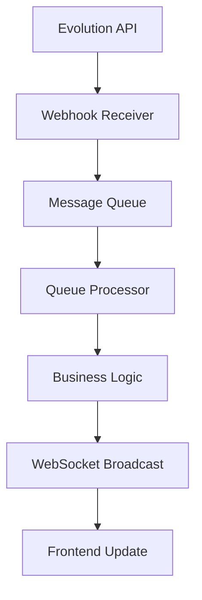
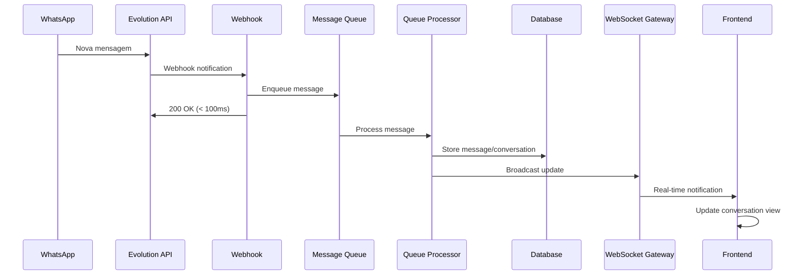
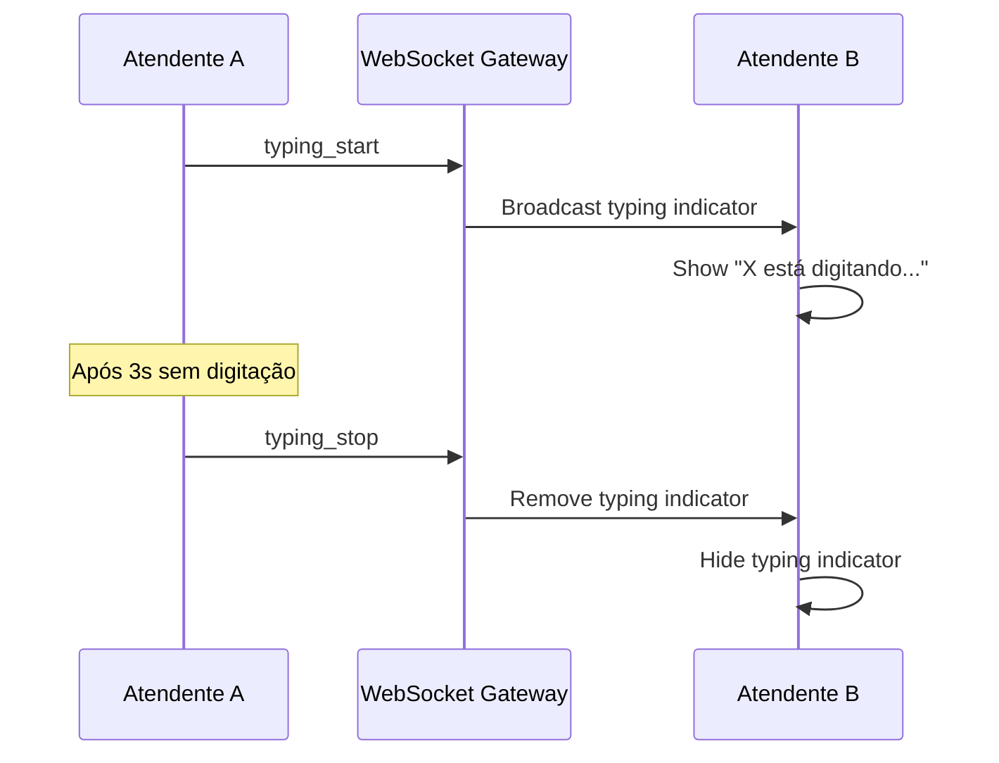
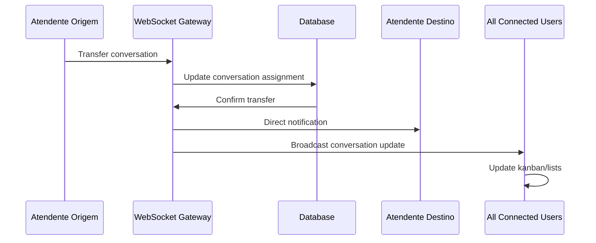

# Arquitetura de Tempo Real - AmpliE Chat Central

## Visão Geral

O AmpliE Chat Central implementa uma arquitetura de comunicação em tempo real robusta e escalável, utilizando WebSockets bidirecionais e otimizações específicas para atendimento multiatendente via WhatsApp.

## 🏗️ Componentes da Arquitetura

### 1. WebSocket Gateway (`realtime-gateway`)

#### Responsabilidades
- Autenticação de usuários e validação de empresa
- Gerenciamento de conexões WebSocket persistentes
- Roteamento de mensagens entre clientes
- Sistema de presença distribuído
- Monitoramento de conexões ativas

#### Implementação
```typescript
// Estrutura do Gateway
interface RealtimeMessage {
  type: 'presence_update' | 'typing_start' | 'typing_stop' | 'message_notification';
  data: any;
  target: 'atendente' | 'conversa' | 'global';
  targetId: string;
}
```

#### Canais Suportados
- `atendente:{userId}` - Notificações pessoais do atendente
- `conversa:{conversaId}` - Eventos específicos da conversa
- `empresa:{empresaId}` - Notificações globais da empresa
- `presence:{empresaId}` - Sistema de presença em tempo real

### 2. Sistema de Presença

#### Funcionalidades
- **Status Online/Offline**: Detecta automaticamente quando usuários entram/saem
- **Indicadores de Digitação**: Mostra quando alguém está digitando em uma conversa
- **Contagem de Usuários**: Quantifica usuários online por empresa
- **Sincronização Multi-Tab**: Mantém consistência entre múltiplas abas

#### Hooks Disponíveis

```typescript
// Hook principal de presença
const {
  onlineUsers,
  isOnline,
  startTyping,
  stopTyping,
  updatePresence
} = usePresenceSystem(empresaId);

// Hook específico para conversas
const {
  typingUsers,
  isConnected,
  sendTypingIndicator,
  notifyNewMessage
} = useConversationRealtime(conversaId);
```

### 3. Webhooks Otimizados

#### Princípios de Design
- **Recebimento Rápido**: Webhook responde em < 100ms
- **Enfileiramento Imediato**: Eventos são enfileirados para processamento assíncrono
- **Separação de Responsabilidades**: Recebimento ≠ Processamento

#### Fluxo de Processamento


### 4. Sistema de Filas Robustas

#### Características
- **Dead Letter Queue (DLQ)**: Isolamento de mensagens falhadas
- **Retry com Backoff**: Reprocessamento inteligente
- **Concorrência Controlada**: `FOR UPDATE SKIP LOCKED`
- **Monitoramento**: Métricas em tempo real

#### Estrutura da Fila
```sql
-- Função otimizada para dequeue
CREATE OR REPLACE FUNCTION get_next_queue_message()
RETURNS TABLE(id uuid, correlation_id uuid, message_type text, payload jsonb, retry_count integer)
AS $$
BEGIN
  RETURN QUERY
  UPDATE message_queue 
  SET 
    status = 'processing',
    processed_at = NOW(),
    retry_count = retry_count + 1
  WHERE id = (
    SELECT mq.id 
    FROM message_queue mq
    WHERE mq.status IN ('pending', 'retrying')
    AND (mq.scheduled_at IS NULL OR mq.scheduled_at <= NOW())
    ORDER BY mq.priority DESC, mq.created_at ASC
    FOR UPDATE SKIP LOCKED
    LIMIT 1
  )
  RETURNING message_queue.id, message_queue.correlation_id, 
            message_queue.message_type, message_queue.payload, 
            message_queue.retry_count;
END;
$$;
```

## 🔄 Fluxos de Comunicação

### 1. Nova Mensagem do Cliente



### 2. Atendente Digitando



### 3. Transferência de Conversa



## 🎯 Otimizações de Performance

### 1. Conexão e Reconexão

```typescript
// Estratégia de reconexão com backoff exponencial
const reconnectConfig = {
  maxAttempts: 5,
  baseDelay: 1000,
  maxDelay: 30000,
  backoffFactor: 2
};

// Auto-reconexão em caso de falha
useEffect(() => {
  const handleReconnect = () => {
    if (!isConnected && attemptCount < maxAttempts) {
      setTimeout(() => {
        connect();
        setAttemptCount(prev => prev + 1);
      }, Math.min(baseDelay * Math.pow(backoffFactor, attemptCount), maxDelay));
    }
  };

  if (!isConnected) {
    handleReconnect();
  }
}, [isConnected, attemptCount]);
```

### 2. Debounce para Typing Indicators

```typescript
// Otimização para evitar spam de typing indicators
const debouncedStopTyping = useMemo(
  () => debounce(() => {
    sendTypingIndicator(false);
  }, 3000),
  [sendTypingIndicator]
);

const handleTyping = useCallback(() => {
  if (!isTyping) {
    sendTypingIndicator(true);
    setIsTyping(true);
  }
  debouncedStopTyping();
}, [isTyping, sendTypingIndicator, debouncedStopTyping]);
```

### 3. Cleanup Automático

```typescript
// Cleanup de indicadores de digitação antigos
useEffect(() => {
  const interval = setInterval(() => {
    const now = new Date().getTime();
    setTypingUsers(prev => prev.filter(user => {
      const userTime = new Date(user.timestamp).getTime();
      return now - userTime < 10000; // Remove se > 10 segundos
    }));
  }, 5000);

  return () => clearInterval(interval);
}, []);
```

## 🚨 Tratamento de Erros e Fallbacks

### 1. Fallback para HTTP Polling

```typescript
// Fallback automático se WebSocket falhar
const useBidirectionalCommunication = (config) => {
  const [connectionType, setConnectionType] = useState<'websocket' | 'polling'>('websocket');
  
  useEffect(() => {
    if (wsConnectionFailed && config.enablePollingFallback) {
      console.warn('WebSocket failed, falling back to HTTP polling');
      setConnectionType('polling');
      startPolling();
    }
  }, [wsConnectionFailed]);
};
```

### 2. Buffer de Mensagens Offline

```typescript
// Buffer para mensagens quando offline
const offlineBuffer = useRef<PendingMessage[]>([]);

const sendMessage = useCallback(async (content: string) => {
  if (!isConnected) {
    // Armazenar no buffer para enviar quando reconectar
    offlineBuffer.current.push({
      id: generateId(),
      content,
      timestamp: new Date(),
      conversaId
    });
    return;
  }
  
  // Enviar normalmente se conectado
  await realSendMessage(content);
}, [isConnected, conversaId]);
```

### 3. Dead Letter Queue para Webhooks

```typescript
// Implementação de DLQ para mensagens falhadas
async function moveToDeadLetterQueue(
  supabase: any, 
  queuedMessage: any, 
  errorMessage: string
) {
  try {
    await supabase
      .from('failed_messages')
      .insert({
        original_message_id: queuedMessage.id,
        correlation_id: queuedMessage.correlation_id,
        message_type: queuedMessage.message_type,
        payload: queuedMessage.payload,
        error_message: errorMessage,
        failure_count: queuedMessage.retry_count + 1,
        metadata: queuedMessage.metadata || {}
      });
  } catch (dlqError) {
    console.error('Failed to move message to DLQ:', dlqError);
  }
}
```

## 📊 Monitoramento e Métricas

### 1. Métricas de Conexão

```typescript
interface ConnectionMetrics {
  totalConnections: number;
  activeConnections: number;
  reconnectionRate: number;
  averageLatency: number;
  errorRate: number;
}

// Coleta automática de métricas
const useConnectionMetrics = () => {
  const [metrics, setMetrics] = useState<ConnectionMetrics>();
  
  useEffect(() => {
    const interval = setInterval(() => {
      collectMetrics().then(setMetrics);
    }, 10000); // A cada 10 segundos
    
    return () => clearInterval(interval);
  }, []);
};
```

### 2. Dashboard de Queue Monitoring

```typescript
// Componente para monitoramento da fila
export function QueueMonitoring() {
  const { queueSize, processingRate, errorRate } = useQueueMetrics();
  
  return (
    <div className="grid grid-cols-1 md:grid-cols-3 gap-4">
      <MetricCard
        title="Tamanho da Fila"
        value={queueSize}
        trend={queueTrend}
        icon={Queue}
      />
      <MetricCard
        title="Taxa de Processamento"
        value={`${processingRate}/min`}
        trend={processingTrend}
        icon={TrendingUp}
      />
      <MetricCard
        title="Taxa de Erro"
        value={`${errorRate}%`}
        trend={errorTrend}
        icon={AlertTriangle}
      />
    </div>
  );
}
```

## 🔧 Configuração e Deployment

### 1. Variáveis de Ambiente

```env
# WebSocket Gateway
REALTIME_GATEWAY_ENABLED=true
WEBSOCKET_MAX_CONNECTIONS=1000
PRESENCE_CLEANUP_INTERVAL=30000

# Queue Processing
QUEUE_BATCH_SIZE=10
QUEUE_PROCESSING_INTERVAL=1000
MAX_RETRY_ATTEMPTS=3
DLQ_ENABLED=true

# Performance
CONNECTION_TIMEOUT=30000
PING_INTERVAL=25000
RECONNECT_MAX_ATTEMPTS=5
```

### 2. Deployment Checklist

- [ ] Edge Functions deployadas (realtime-gateway, webhooks, processors)
- [ ] Migrações de banco aplicadas
- [ ] Variáveis de ambiente configuradas
- [ ] Webhooks da Evolution API apontando para produção
- [ ] Monitoramento de logs ativo
- [ ] Dead Letter Queue configurada
- [ ] Rate limiting configurado
- [ ] SSL/TLS configurado para WebSocket

## 🧪 Testes da Arquitetura Real-time

### 1. Testes de Conexão

```typescript
describe('WebSocket Connection', () => {
  test('should connect and authenticate', async () => {
    const connection = new WebSocketConnection(config);
    await connection.connect();
    
    expect(connection.isConnected).toBe(true);
    expect(connection.isAuthenticated).toBe(true);
  });
  
  test('should handle reconnection', async () => {
    const connection = new WebSocketConnection(config);
    connection.disconnect();
    
    // Simular falha de rede
    mockNetworkFailure();
    
    await waitFor(() => {
      expect(connection.isConnected).toBe(true);
    });
  });
});
```

### 2. Testes de Presença

```typescript
describe('Presence System', () => {
  test('should track user online status', async () => {
    const { result } = renderHook(() => usePresenceSystem(empresaId));
    
    act(() => {
      result.current.goOnline();
    });
    
    expect(result.current.isOnline).toBe(true);
    expect(result.current.onlineUsers).toContain(userId);
  });
});
```

## 📈 Roadmap de Melhorias

### Próximas Implementações
- [ ] Clustering de WebSocket para alta disponibilidade
- [ ] Compressão de mensagens WebSocket
- [ ] Sharding de conexões por região
- [ ] Cache distribuído para presença
- [ ] Métricas avançadas com Prometheus
- [ ] Auto-scaling baseado em conexões ativas

### Otimizações Futuras
- [ ] HTTP/3 para WebSocket quando disponível
- [ ] Edge caching para mensagens frequentes
- [ ] Previsão de carga com ML
- [ ] Balanceamento inteligente de conexões

---

Esta arquitetura garante comunicação em tempo real robusta, escalável e otimizada para o ambiente de atendimento multiatendente do AmpliE Chat Central.